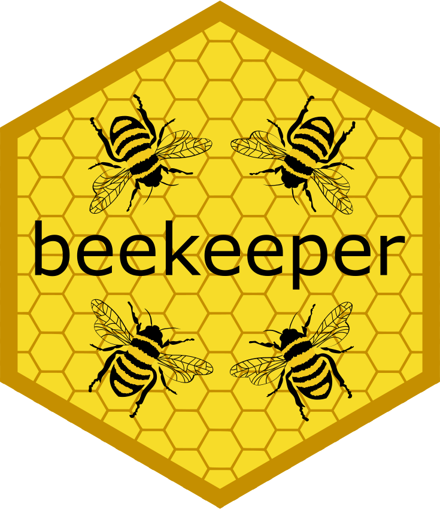

# Building the Hive:

[Collaborating on API Packages with {beekeeper}]{style="font-size: 1.5em"}

::: notes
- Thank Francis and the Ghana R Users Community
- Introduce myself
- Data Science Learning Community (DSLC.io)
- @jonthegeek (mostly BlueSky, LinkedIn, GitHub)
- How you can help me make APIs easier to use in R
- Slides at api2r.org/ghana2025
- Old talk introducing APIs: DSLC.io/ghana202306
- This talk about what I've been up to since
:::

# 🎯 What is a web API?

## 📘 APIs are: {transition="slide-in none-out"}

🤖↔️🤖 Services that 

- Enable communication 
- Between computer programs

::: notes
- "Application programming interface." (but almost always API)
- "Services that enable communication between computer programs."
- You might hear the arguments to a function referred to as the "API" of that function.
:::

## 📘 Web APIs are: {transition="none-in slide-out"}

🤖↔️🤖 Services that 

::: nonincremental
- Enable communication 
- Between computer programs
- *On the internet*
:::

::: notes
- For the rest of this talk, "API" = "web API".
:::

## 📆 You use web APIs every day!

- "Login with {height="30"} | {height="30" style="text-align: top;"}"
- "Create {height="20"} meeting" in work messenger
- "📅 Add to Calendar"
- *Loading any web page == `GET`*

::: notes
- (don't comment on logo alignment)
- Zoom: Or similar app integrations.
- Button on a web page, goes to Google or Apple calendar, etc.
- For "Loading any":
    - When you fetch a web page, you're using the GET method to ask the server to send you the page.
    - There are 5 main methods for web apis.
        - GET, POST = create something new usually, PUT = replace, PATCH = edit, DELETE; often just GET and/or POST

:::

## 🔍 How do you find APIs?

- Use browser network tab
  - Look for `fetch()` or `XHR`
  - {apisniffer} experiment at [jonthegeek.github.io/apisniffer](https://jonthegeek.github.io/apisniffer/)
- [Find APIs](https://dslc-io.github.io/club-wapir/slides/apis-find.html) chapter
  - Learn more about [Web APIs with R (DSLC.io/wapir)](https://DSLC.io/wapir)

::: notes
- Network tab can reveal what the browser is calling behind the scenes.
- {apisniffer} is very experimental and I haven't updated it in a while, but hope to get back to it soon
- Lots more about finding APIs in my book!
- I'm writing a book! Join DSLC.io to join the next book club cohort!

:::


# 📄 How are APIs documented?

## 👩️ Human vs 🤖 Machine

- 👩 : prose & examples
- 🤖 : structured specs
- **Swagger** = structured API specification
- **OpenAPI** = new name of Swagger

::: notes
- Humans and sometimes genAI now, but mostly humans.
- As a programmer, I also like structure, so I can look for standard things!
- Swagger was made for a dictionary site, to describe APIs in a standard way. I *think* they were working with multiple APIs and wanted to standardize them.
- Donated to the Linux Foundation in 2015.
- Renamed to the "OpenAPI Specification".
- Swagger 2.0 = OpenAPI 2.0 (there isn't really OpenAPI 1.0).
- Currently on v3.1.1.
:::

## 🔎 A sample OpenAPI spec (YAML/JSON)

```yaml
openapi: 3.0.1
info:
  title: Sample API
  version: 1.0.0
paths:
  /users:
    get:
      summary: Get all users
      responses:
        '200':
          description: OK
```

::: notes
- JSON = JavaScript Object Notation
- YAML = superset of JSON, more human-readable
- This is a tiny sample of what a full API spec might include.
- Version of the specification on line 1. Sometimes this will be `swagger:` instead of `openapi:` in old specs.
- `info` contains basic information about the API. Can include contact info, license, etc.
- `paths` section is where the API endpoints live — this one has `/users`.
- I mentioned API methods before. This path uses `get`.
- `200` means OK/success.
- Specs can also describe `servers`, `security`, reusable `components` for things that recur in the spec, and more.
- (If connection stable, tab to full spec)
- Key point: tools can parse this to talk to the API.
:::

# 🐝 The api2r project

## 🚀 Goal: *Easier* API →️ R 📦

- Common patterns in API R packages
- The system should:
  - Parse the spec
  - Scaffold reusable code
  - Add docs and tests *by default*

::: notes
- I've wrapped APIs manually—it’s not fun.
- My goal: reduce effort, make it repeatable.
- We should start with the spec and generate most of the rest.
- Think of this as the {usethis} for API packages.
- R Consortium grant to create {api2r}.
- Ended up with three packages, each handling part of the process.
:::

## 📦 Package 1: `{rapid}`

- [rapid.api2r.org](https://rapid.api2r.org)
- Input: OpenAPI (JSON/YAML)
- Output: structured **R object** ([{S7}](https://rconsortium.github.io/S7/))
- Can inspect/edit before pkg step

::: notes
- R API Description
- `{rapid}` is the parser — it takes your OpenAPI spec and builds a structured R object.
- Can work with URLs to JSON or YAML specs, local spec files, or even in-memory lists.
- Uses the new S7 object system, which makes the output strict and composable.
- These objects are nested — one for the whole API, one per path, one per method, etc.
- You can look at or manipulate them before building the actual package.
- That’s useful if the API is too big or you only want a few endpoints, or if you want to edit the authentication.
:::

## 📦 Package 2: `{beekeeper}`

- [beekeeper.api2r.org](https://beekeeper.api2r.org)
- Input: a `rapid` object
- Output: Full R **package skeleton**
  - Standardized functions for every API path + method
  - Full {roxygen2} docs
  - Starter {testthat} / {httptest2} tests

::: notes
- apis = Latin name for "bee", so beekeepers work with "apis". Also fits with package hex logos.
- `{beekeeper}` takes the parsed API and scaffolds a complete package.
- That includes function files, tests, docs, and a DESCRIPTION file.
- Mostly uses the next package we'll talk about for function calls.
- You'll need to refine manually, but it gives a solid foundation.
- I'm actively working on a big update, watch the repo!
:::

## 📦 Package 3: `{nectar}`

- [nectar.api2r.org](https://nectar.api2r.org)
- Used inside generated packages
- Wraps {httr2}, {tibblify}, {stbl}
- Helper functions for:
  - Making requests
  - Handling pagination/retries
  - Tidying responses

::: notes
- `{nectar}` is an *opinionated* helper package.
  - Opinionated = Do things the way I think you should (slightly lower flexibility vs httr2).
- Wraps my {stbl} package to "stabilize" inputs to expected formats, or error before hitting the API if inputs won't work.
- Wraps {httr2} for common API tasks.
- Optionally wraps {tibblify} to make it easier to get tidy outputs.
- Also includes helpers for common pain points like pagination and retries.
- Keeps generated packages clean and consistent.
:::

## 🔁 Full process

```r
spec <- rapid::as_rapid("https://my.api/openapi.yaml")
beekeeper::use_beekeeper(spec, "myapi")
beekeeper::generate_pkg()
```

- Generated packages are *R packages*
- Edit and maintain as usual!

::: notes
- This is the whole flow in 3 lines!
- `as_rapid()` reads & parses the OpenAPI spec.
- `use_beekeeper()` sets up the package configuration and logs info about the spec. Gives opportunity to tweak before generation.
- `generate_pkg()` writes all the package files, including docs and tests.
- After that, it’s just like any other R package.
- The goal is not to avoid editing — it’s to give you a head start.
:::

# 🤝 How can you help?

## 🧩 Do you work with a weird API?

- Data science, gov, research, etc
- Lots of APIs aren't R-friendly
- Let's fix that!

::: notes
- I *want* to collaborate.
- If you’ve wrestled with an obscure or homegrown API, that’s exactly what I want to hear about.
- Right now the API needs to have an OpenAPI or Swagger spec.
- Right now I need people who want to dig in and create their own package.
:::

## 🔍 Find an OpenAPI spec

- Start with the docs!
- Try `/swagger.json`, `/openapi.json`
  - `/swagger.yaml`, `/swagger.yml`, `/openapi.yaml`, `/openapi.yml`
- ChatGPT (etc) pretty good at spotting specs

::: notes
- If specs have a common structure & place to test the code, it’s probably using OpenAPI under the hood.
- Also try .yaml, .yml.
- Even if the spec isn’t linked, it might be discoverable.
:::

## 🐝 What to do

- Visit [beekeeper.api2r.org](https://beekeeper.api2r.org/)
- Click "Report a bug"
- Open a new issue for your API

::: notes
- You can find all these links at api2r.org/ghana2025.
- I'd love to know what kinds of APIs you want in R.
- The more real users I hear from, the better I can shape the tools.
:::

# 🙏 Thanks!

::: nonincremental
- 🐙 GitHub: [github.com/api2r/beekeeper](https://github.com/api2r/beekeeper)
- 🐝 Website: [beekeeper.api2r.org](https://beekeeper.api2r.org)
- 📬 Contact: [@jonthegeek](https://bsky.app/profile/jonthegeek.com), [DSLC.io](https://DSLC.io)
:::

::: notes
- Thanks again to Francis and the Ghana R community.
- Please reach out with questions, ideas, or weird APIs!
- Hope to see some collaboration soon.
- For Q&A: I'd love to hear about any APIs people use or want to use!
:::
